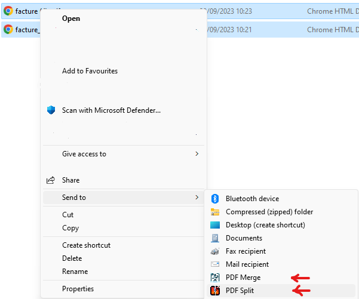

# right-click-pdf

Adds 2 options to the context menu `Send to` :
- `PDF Merge` : when selecting multiple PDFs, it will create a new pdf containing all selected PDFs
- `PDF Split` : when selecting a PDF, it will create a PDF per page (eg 1 PDF with 5 pages => 5 PDFs of 1 page)

[Download - InstallPDFRightClick.exe](https://github.com/remmel/pdf-right-click/releases/latest/download/InstallPDFRightClick.exe)

# Developer

# Install / Uninstall

- application will be stored in `%USERPROFILE%\AppData\Local\PDFRightClick`
- the uninstaller will be added in the windows `add or remove programs` menu 

# Tools used

- pdftk is used : https://www.pdflabs.com/tools/pdftk-the-pdf-toolkit/ and will be installed during the installation - TODO use something smaller
- NSIS 3.09 is used to create the installer